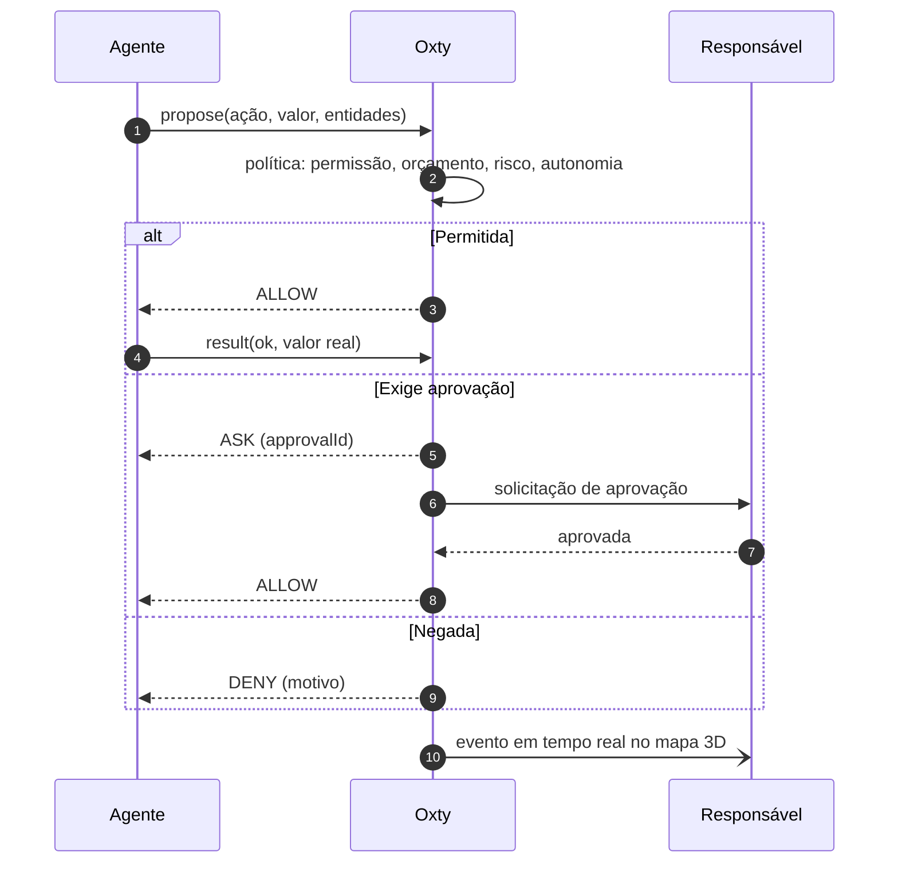
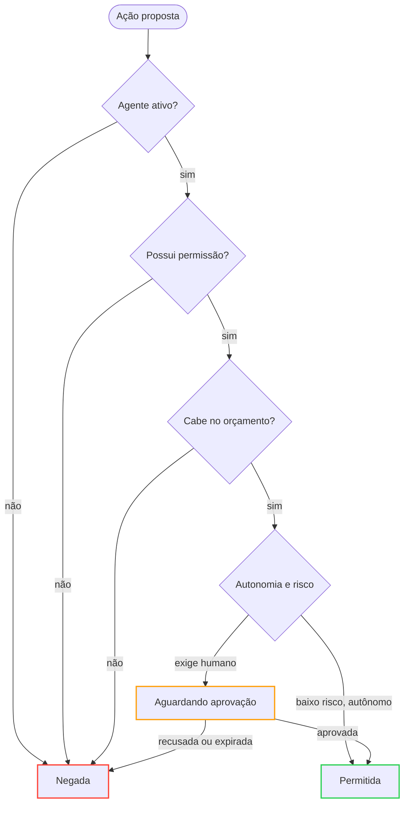
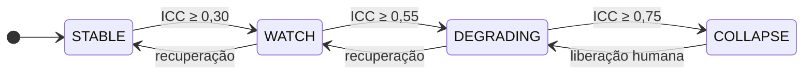
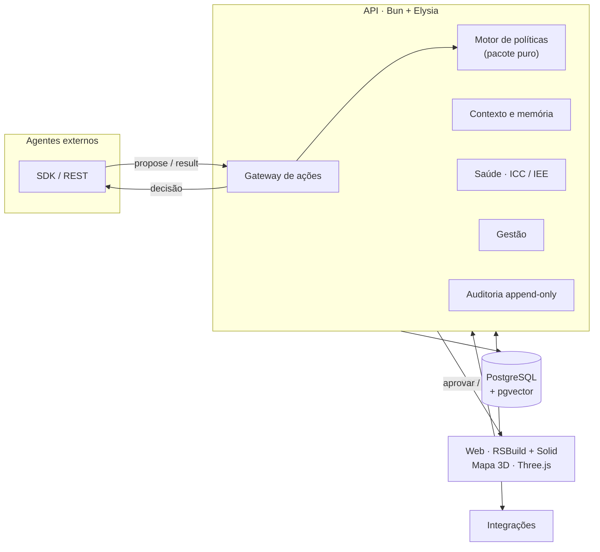
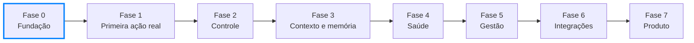

<div align="center">

<br />

# Oxty

**Plano de controle para ecossistemas de agentes de IA**

Define o que os agentes podem fazer, exige aprovação humana quando importa,<br />
preserva contexto e memória e mede a saúde de cada agente e do conjunto.

<br />


<br />


<br />

[Visão geral](#visão-geral) · [Como funciona](#como-funciona) · [Capacidades](#capacidades) · [Saúde dos agentes](#saúde-dos-agentes) · [Arquitetura](#arquitetura) · [Início rápido](#início-rápido) · [Roadmap](#roadmap)

<br />

Fonte de verdade: [`docs/OXTY-SPEC.md`](docs/OXTY-SPEC.md)

</div>

---

> [!NOTE]
> O projeto está na **Fase 0 (fundação)**. As capacidades descritas neste documento são o escopo planejado; cada uma indica a fase em que será entregue (ver [Roadmap](#roadmap)).

## Visão geral

O Oxty **não executa** o trabalho dos agentes: ele o **governa**. Cada efeito colateral que um agente deseja causar passa por uma política central, que permite, nega ou encaminha a ação para aprovação humana. Todo o histórico é registrado e exibido em um mapa 3D em tempo real.

| Princípio | Descrição |
|---|---|
| Calma por padrão | A interface mostra apenas o necessário. O detalhe aparece sob demanda. |
| Controle antes de autonomia | Todo agente nasce restrito e ganha autonomia com histórico. |
| Tudo é evento | Nada acontece sem registro imutável e rastreável. |
| Falha segura | Em caso de dúvida, o sistema reduz a autonomia em vez de prosseguir. |
| Transparência cognitiva | É sempre possível verificar o que o agente sabia ao decidir. |
| Agnóstico de agente | Qualquer agente (Claude, GPT, scripts, n8n) se conecta por um contrato simples. |

## Como funciona

Toda ação proposta por um agente é avaliada e segue um de três caminhos: permitida, enviada para aprovação ou negada.



### Ordem de avaliação



No mapa 3D, cada resultado possui uma representação própria: a partícula segue até o núcleo (permitida), para no portão (aguardando aprovação) ou retorna ao agente (bloqueada).

## Capacidades

| Capacidade | Escopo | Fase |
|---|---|:---:|
| **Controle** | Permissões por agente, tetos de gasto com reserva atômica, autonomia (`auto`, `approve`, `double`), dupla aprovação por pessoas distintas, pausa individual e global | 1–2 |
| **Auditoria** | Trilha append-only com hash encadeado e verificação de integridade | 2 |
| **Contexto** | Documentos versionados (empresa, regras, FAQ, playbooks), precedência por escopo, diff e publicação em etapas | 3 |
| **Memória** | Episódica, semântica e procedural, com revisão humana, consolidação, defesa contra envenenamento e direito ao esquecimento (LGPD/GDPR) | 3 |
| **Saúde** | Índice de Colapso Cognitivo (ICC) por agente e Índice de Estresse do Ecossistema (IEE), com resposta automática e incidentes | 4 |
| **Gestão** | Resumo diário, relatório semanal, mudanças com canário e rollback automático, versionamento de agentes | 5 |
| **Integrações** | Adaptadores, cofre de segredos, webhooks assinados e proxy de ferramentas (o agente nunca acessa a credencial) | 6 |

## Saúde dos agentes

O sistema mede sintomas observáveis (repetição, saturação de contexto, deriva, citação de entidades inexistentes, taxa de erro, rejeição humana) e os combina em um índice de 0 a 1. A resposta é proporcional ao nível.



| Nível | Resposta do sistema |
|---|---|
| STABLE | Nenhuma ação |
| WATCH | Alerta discreto no card do agente, com o sinal em destaque |
| DEGRADING | Reduz a autonomia em um nível, limita a taxa de ações e abre incidente |
| COLLAPSE | Quarentena: nega novas ações e notifica os aprovadores. Somente uma pessoa libera. |

> [!WARNING]
> Os limiares são pontos de partida e exigem calibração. A Fase 4 inclui um modo sombra, que mede sem agir, para validar os alertas antes de confiar neles. Detalhes na seção 11 da spec.

## Arquitetura



`policy`, `health`, `context` e `memory` são pacotes puros, sem I/O. As rotas da API são finas: carregam dados, chamam o pacote e persistem o resultado. Isso mantém o núcleo testável sem banco de dados.

## Início rápido

Fase 0. Pré-requisitos: [Bun](https://bun.sh) 1.2 ou superior e Docker Desktop em execução.

```powershell
cp .env.example .env          # configurações locais
bun install                   # instala tudo (monorepo)
bun run db:up                 # sobe Postgres + pgvector no Docker
bun run db:migrate            # cria as tabelas (primeira vez: --name init)
bun test                      # testes unitários
bun run dev                   # API (3000) + Web (5173) juntos
```

| Serviço | Endereço |
|---|---|
| API | <http://localhost:3000> |
| Web | <http://localhost:5173> |

### Aceite da Fase 0

Criar usuário e workspace por API:

```powershell
# 1. Criar usuário
curl -X POST http://localhost:3000/v1/users -H "Content-Type: application/json" `
  -d '{"email":"voce@exemplo.com","name":"Você","password":"senha-forte-123"}'

# 2. Login → copie o token
curl -X POST http://localhost:3000/v1/sessions -H "Content-Type: application/json" `
  -d '{"email":"voce@exemplo.com","password":"senha-forte-123"}'

# 3. Criar workspace (com o token)
curl -X POST http://localhost:3000/v1/workspaces -H "Content-Type: application/json" `
  -H "Authorization: Bearer SEU_TOKEN" -d '{"name":"Meu Ecossistema"}'
```

<details>
<summary>Equivalente em bash (Linux e macOS)</summary>

<br />

```bash
curl -X POST http://localhost:3000/v1/users -H "Content-Type: application/json" \
  -d '{"email":"voce@exemplo.com","name":"Você","password":"senha-forte-123"}'

curl -X POST http://localhost:3000/v1/sessions -H "Content-Type: application/json" \
  -d '{"email":"voce@exemplo.com","password":"senha-forte-123"}'

curl -X POST http://localhost:3000/v1/workspaces -H "Content-Type: application/json" \
  -H "Authorization: Bearer SEU_TOKEN" -d '{"name":"Meu Ecossistema"}'
```

</details>

## Estrutura

```
apps/api        API (Bun + Elysia) — rotas finas, sem regra de negócio
apps/web        Web (RSBuild + Solid + TanStack)
packages/shared Schemas Zod — única fonte de verdade dos contratos
packages/*      policy, health, context, memory (PUROS — chegam na Fase 1/3/4)
prisma/         Schema e migrações (Postgres + pgvector)
infra/          docker-compose
docs/           Spec, ADRs, diário, parking-lot
```

## Stack

| Camada | Tecnologia |
|---|---|
| Runtime e API | Bun, ElysiaJS |
| Contratos | Zod (pacote `shared`, usado por API, SDK e Web) |
| Banco | PostgreSQL com pgvector, Prisma |
| Web | RSBuild, Solid, TanStack, UnoCSS, Kobalte |
| 3D | Three.js |
| Infraestrutura local | Docker Compose |

## Roadmap

Cada fase termina com uma demonstração de aceite. A fase seguinte só começa depois dela.



| Fase | Status | Entrega | Critério de aceite | Duração |
|:---:|---|---|---|:---:|
| 0 | Em andamento | Monorepo, CI, Docker, Prisma, autenticação, schemas Zod | Criar usuário e workspace por API | ~1 sem |
| 1 | Planejada | Registro de agentes, `propose/result`, política v1, aprovação, SSE, mapa 3D com eventos reais | Um script real propõe 10 ações: 6 passam, 2 pedem aprovação, 2 são negadas, e tudo aparece no mapa | ~2 sem |
| 2 | Planejada | Dupla aprovação, orçamento atômico, auditoria com hash, RBAC, pausa global | Teste de carga sem estourar o limite; `audit/verify` detecta adulteração | ~2 sem |
| 3 | Planejada | Páginas de Contexto e Memória, `context.pack`, registro do que o agente sabia | Alterar uma regra muda o comportamento do agente; apagar uma memória remove o embedding | ~3 sem |
| 4 | Planejada | Sinais, ICC/IEE, modo sombra, incidentes, resposta automática | Um loop injetado é detectado, o agente é rebaixado e depois se recupera | ~3 sem |
| 5 | Planejada | Relatórios, mudanças com canário, rollback, versionamento | Uma mudança ruim em canário é revertida automaticamente | ~2 sem |
| 6 | Planejada | Cofre de segredos, primeira integração real, proxy de ferramentas, webhooks, testes de caos | O agente executa uma ação sem nunca acessar a credencial | ~4 sem |
| 7 | Planejada | Multi-tenant completo, billing, onboarding, SDKs, status page | — | contínuo |

## Governança do projeto

- Nada entra no código sem estar na spec; mudanças na spec vão para a seção 24 (registro de decisões).
- Ideias novas → [`docs/parking-lot.md`](docs/parking-lot.md). Progresso → [`docs/diario.md`](docs/diario.md).
- Decisões → [`docs/adr/`](docs/adr/).

### Contribuição

1. Leia a [spec](docs/OXTY-SPEC.md) e identifique a fase em que o item se encaixa.
2. Abra uma issue descrevendo a fatia de trabalho, idealmente de até um dia.
3. Escreva os testes primeiro. O motor de políticas segue a tabela de decisão da seção 6 da spec.
4. Se a mudança alterar uma decisão arquitetural, registre um ADR em `docs/adr/`.

## Licença

A definir. Enquanto não houver um arquivo `LICENSE`, todos os direitos são reservados.
