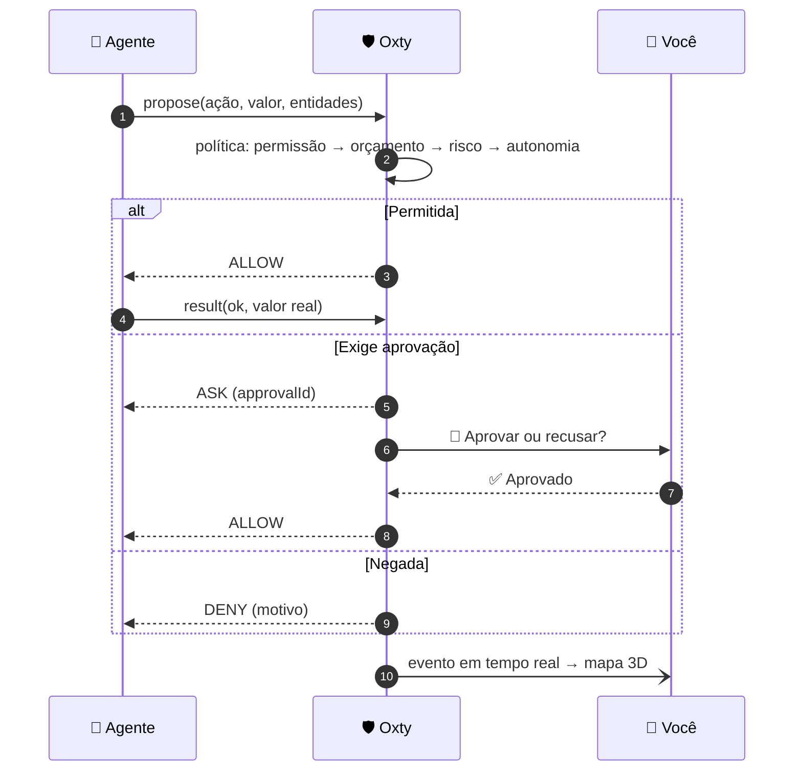
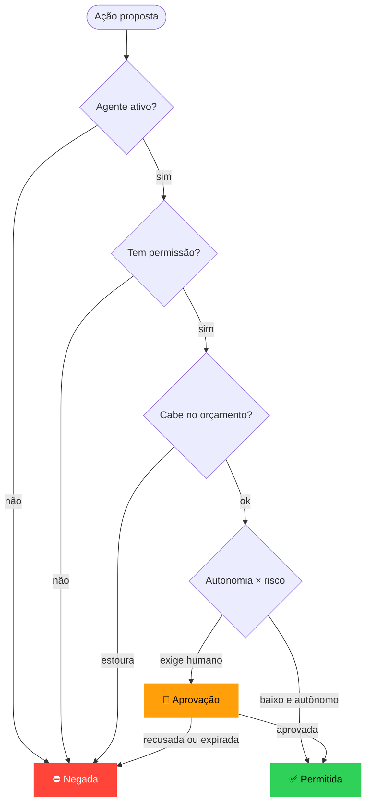
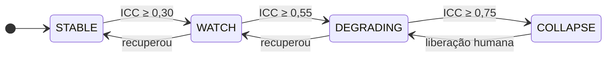
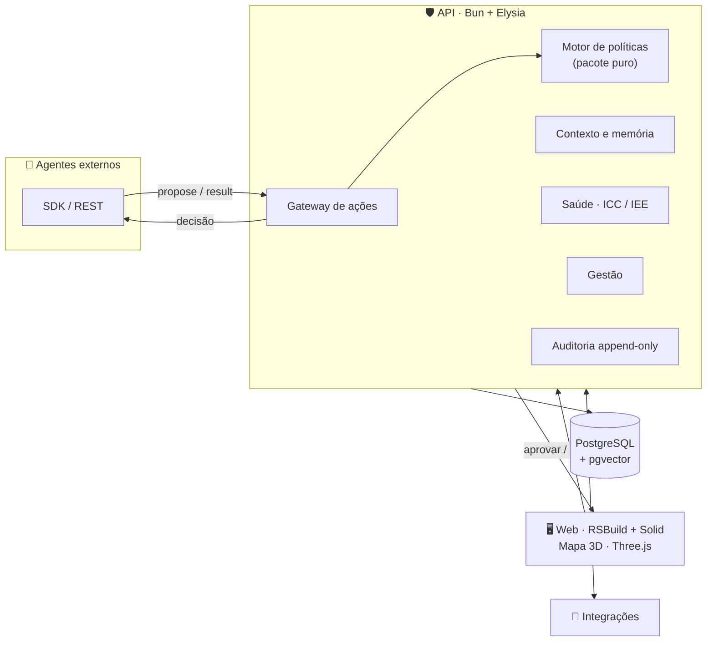
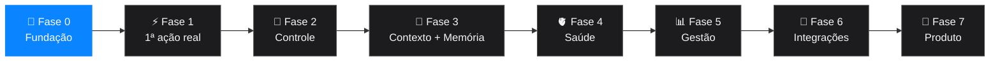

<!-- ⚙️ ANTES DE PUBLICAR: substitua SEU_USUARIO pelo seu usuário/organização do GitHub (busca e substitui em todo o arquivo). -->

<div align="center">


<a href="https://git.io/typing-svg"></a>

<br />


[](https://github.com/SEU_USUARIO/Oxty/commits)
[](https://github.com/SEU_USUARIO/Oxty/stargazers)


<br />



<br />

**[✨ O que é](#-o-que-é)** · **[🎬 Como funciona](#-como-funciona)** · **[🧩 Pilares](#-pilares)** · **[🫀 Saúde](#-saúde-cognitiva)** · **[🧱 Arquitetura](#-arquitetura)** · **[🚀 Começar](#-começar-em-5-minutos)** · **[🧭 Roadmap](#-roadmap)**

</div>


> [!IMPORTANT]
> **Fonte de verdade:** [`docs/Oxty-SPEC.md`](docs/Oxty-SPEC.md). Este README é o resumo; qualquer dúvida de escopo, contrato ou ordem de entrega se resolve na spec.

> [!NOTE]
> 🚧 **Projeto em construção.** A **Fase 0 (fundação) está concluída** e estamos na **Fase 1 (primeira ação real)**. Tudo o que aparece abaixo como "Pilares" e "Saúde" é o **destino planejado**, com a fase de entrega indicada no [Roadmap](#-roadmap).

## ✨ O que é

**Oxty é o plano de controle de um ecossistema de agentes de IA.** Ele **não executa** o trabalho dos agentes — ele **governa**:

- 🛂 decide **o que pode acontecer** (permissões, limites de gasto, autonomia);
- 🔔 **pede aprovação humana** quando importa (dinheiro, exclusão, comunicação em massa);
- 🧠 guarda **contexto** curado e **memória** aprendida, com versão e proveniência;
- 🫀 mede a **saúde** de cada agente e do conjunto, e avisa antes do estrago;
- 🌌 mostra tudo num **mapa 3D em tempo real**, calmo por padrão e detalhado sob demanda.

### Princípios

| | Princípio | Na prática |
|---|---|---|
| 🧘 | **Calma por padrão** | A tela mostra só o necessário; o detalhe aparece quando você pede |
| 🔒 | **Controle antes de autonomia** | Todo agente nasce restrito e ganha autonomia com histórico |
| 🧾 | **Tudo é evento** | Nada acontece sem registro imutável e rastreável |
| 🧯 | **Falhar de forma segura** | Em dúvida, o sistema reduz a autonomia em vez de seguir adiante |
| 🔍 | **Transparência cognitiva** | Sempre dá para ver *o que o agente sabia* quando decidiu |
| 🔌 | **Agnóstico de agente** | Qualquer agente (Claude, GPT, scripts, n8n) conecta por um contrato simples |


## 🎬 Como funciona

Todo efeito colateral que um agente quer causar vira uma **ação proposta**. O Oxty avalia, e a ação segue um de três caminhos.



### A decisão, passo a passo



> [!TIP]
> No mapa 3D cada caminho tem uma coreografia própria: a partícula **segue** até o núcleo (permitida), **para no portão** (aguardando você) ou **bate e volta** (bloqueada).

## 🧩 Pilares

| Pilar | O que entrega | Fase |
|---|---|:---:|
| 🛂 **Controle** | Permissões por agente, tetos de gasto com reserva atômica, autonomia (`auto` · `approve` · `double`), dupla aprovação por humanos distintos, pausa individual e global | 1–2 |
| 📚 **Contexto** | Documentos versionados (empresa, regras, FAQ, playbooks), precedência por escopo, diff, rascunho → revisão → publicado, "o que o agente sabia" em cada execução | 3 |
| 🧠 **Memória** | Episódica, semântica e procedural; fila de revisão humana; consolidação; defesa contra envenenamento; direito de esquecer (LGPD/GDPR) | 3 |
| 🫀 **Saúde** | Índice de Colapso Cognitivo por agente (ICC) e Índice de Estresse do Ecossistema (IEE), com respostas automáticas e incidentes | 4 |
| 📊 **Gestão** | Resumo da manhã, relatório semanal, mudanças com canário e rollback automático, versionamento de agentes | 5 |
| 🔌 **Integrações** | Adaptadores, cofre de segredos, webhooks assinados e *tool proxy* (o agente nunca vê a credencial) | 6 |
| 🧾 **Auditoria** | Trilha append-only com hash encadeado e verificação de integridade | 2 |

## 🫀 Saúde cognitiva

O sistema **mede sintomas observáveis** — repetição, saturação de contexto, deriva, citação de entidades inexistentes, taxa de erro, rejeição humana — e os combina num índice de 0 a 1. Reage de forma proporcional:



| Nível | Resposta do sistema |
|---|---|
| 🟢 **STABLE** | Nada a fazer |
| 🟡 **WATCH** | Alerta discreto no card, com o sinal destacado |
| 🟠 **DEGRADING** | Rebaixa a autonomia um degrau, reduz a taxa e abre incidente |
| 🔴 **COLLAPSE** | **Quarentena**: nega novas ações e notifica os aprovadores. Só um humano libera |

> [!WARNING]
> Os limiares são **pontos de partida**, não verdade absoluta. A Fase 4 inclui **modo sombra** (mede sem agir) para calibrar antes de confiar nos alertas. Detalhes na seção 11 da spec.


## 🧱 Arquitetura



**Regra de arquitetura:** `policy`, `health`, `context` e `memory` são **pacotes puros** (sem I/O). As rotas da API são finas: carregam dados, chamam o pacote e persistem o resultado. Isso deixa o núcleo testável sem banco.

## 🚀 Começar em 5 minutos

**Fase 0.** Pré-requisitos: [Bun](https://bun.sh) ≥ 1.2 e Docker Desktop rodando.

```powershell
cp .env.example .env          # configurações locais
bun install                   # instala tudo (monorepo)
bun run db:up                 # sobe Postgres + pgvector no Docker
bun run db:migrate            # cria as tabelas (primeira vez: --name init)
bun test                      # testes unitários
bun run dev                   # API (3000) + Web (5173) juntos
```

| Serviço | Endereço |
|---|---|
| 🛡️ API | <http://localhost:3000> |
| 🖥️ Web | <http://localhost:5173> |

### ✅ Aceite da Fase 0

Criar usuário e workspace por API:

```powershell
# 1. Criar usuário
curl -X POST http://localhost:3000/v1/users -H "Content-Type: application/json" `
  -d '{"email":"voce@exemplo.com","name":"Você","password":"senha-forte-123"}'

# 2. Login → copie o token
curl -X POST http://localhost:3000/v1/sessions -H "Content-Type: application/json" `
  -d '{"email":"voce@exemplo.com","password":"senha-forte-123"}'

# 3. Criar workspace (com o token)
curl -X POST http://localhost:3000/v1/workspaces -H "Content-Type: application/json" `
  -H "Authorization: Bearer SEU_TOKEN" -d '{"name":"Meu Ecossistema"}'
```

<details>
<summary><b>🐧 Prefere bash (Linux/macOS)?</b></summary>

<br />

```bash
curl -X POST http://localhost:3000/v1/users -H "Content-Type: application/json" \
  -d '{"email":"voce@exemplo.com","name":"Você","password":"senha-forte-123"}'

curl -X POST http://localhost:3000/v1/sessions -H "Content-Type: application/json" \
  -d '{"email":"voce@exemplo.com","password":"senha-forte-123"}'

curl -X POST http://localhost:3000/v1/workspaces -H "Content-Type: application/json" \
  -H "Authorization: Bearer SEU_TOKEN" -d '{"name":"Meu Ecossistema"}'
```

</details>

## 📁 Estrutura

```
apps/api        API (Bun + Elysia) — rotas finas, sem regra de negócio
apps/web        Web (RSBuild + Solid + TanStack)
packages/shared Schemas Zod — única fonte de verdade dos contratos
packages/*      policy, health, context, memory (PUROS — chegam na Fase 1/3/4)
prisma/         Schema e migrações (Postgres + pgvector)
infra/          docker-compose
docs/           Spec, ADRs, diário, parking-lot
```

## 🧰 Stack

<div align="center">


</div>

| Camada | Tecnologia |
|---|---|
| Runtime e API | **Bun** · **ElysiaJS** |
| Contratos | **Zod** (pacote `shared` compartilhado entre API, SDK e Web) |
| Banco | **PostgreSQL** + **pgvector** · **Prisma** |
| Web | **RSBuild** · **Solid** · **TanStack** · **UnoCSS** · **Kobalte** |
| 3D | **Three.js** |
| Infra local | **Docker Compose** |

## 🧭 Roadmap

Cada fase termina com uma **demonstração de aceite**. Não se começa a próxima sem ela.



| Fase | Entrega | Aceite | Duração |
|:---:|---|---|:---:|
| 🔵 **0** | Monorepo, CI, Docker, Prisma, auth, schemas Zod | Criar usuário e workspace por API | ~1 sem |
| ⚪ **1** | Registrar agente, `propose/result`, política v1, aprovação, SSE e mapa 3D com eventos reais | Um script real propõe 10 ações: 6 passam, 2 pedem aprovação, 2 são negadas, tudo aparece no mapa | ~2 sem |
| ⚪ **2** | Dupla aprovação, orçamento atômico, auditoria com hash, RBAC, kill switch | Teste de carga sem estourar o limite; `audit/verify` detecta adulteração | ~2 sem |
| ⚪ **3** | Páginas de Contexto e Memória, `context.pack`, "o que o agente sabia" | Mudar uma regra altera o comportamento do agente; apagar memória remove o embedding | ~3 sem |
| ⚪ **4** | Sinais, ICC/IEE, modo sombra, incidentes, resposta automática | *Loop* injetado é detectado, rebaixado e recuperado | ~3 sem |
| ⚪ **5** | Relatórios, mudanças com canário, rollback, versionamento | Mudança ruim em canário volta sozinha | ~2 sem |
| ⚪ **6** | Cofre, 1ª integração real, *tool proxy*, webhooks, testes de caos | Agente age sem nunca ver a credencial | ~4 sem |
| ⚪ **7** | Multi-tenant completo, billing, onboarding, SDKs, status page | — | contínuo |

<!-- 🎥 DEMO: grave um GIF/vídeo de 60–90 s do mapa 3D funcionando, salve em docs/assets/demo.gif e descomente a linha abaixo.
<div align="center"></div>
-->


## 🤝 Governança do projeto

- Nada entra no código sem estar na spec; mudanças na spec vão para a **seção 24** (registro de decisões).
- Ideias novas → [`docs/parking-lot.md`](docs/parking-lot.md). Progresso → [`docs/diario.md`](docs/diario.md).
- Decisões → [`docs/adr/`](docs/adr/).

### Contribuindo

1. Leia a [spec](docs/Oxty-SPEC.md) e confirme em qual **fase** o item se encaixa.
2. Abra uma *issue* descrevendo a fatia (idealmente de até 1 dia de trabalho).
3. Teste primeiro: o motor de políticas segue a tabela de decisão da seção 6.
4. Mudança de decisão arquitetural? Registre um ADR em `docs/adr/`.

<details>
<summary><b>⭐ Histórico de estrelas e contribuidores</b></summary>

<br />

<a href="https://star-history.com/#SEU_USUARIO/Oxty&Date">
  
</a>

<a href="https://github.com/SEU_USUARIO/Oxty/graphs/contributors">
  
</a>

</details>

## 📜 Licença

A definir. Enquanto não houver um arquivo `LICENSE`, todos os direitos são reservados.

<div align="center">


**Governe com calma. Aprove o que importa.**

</div>
